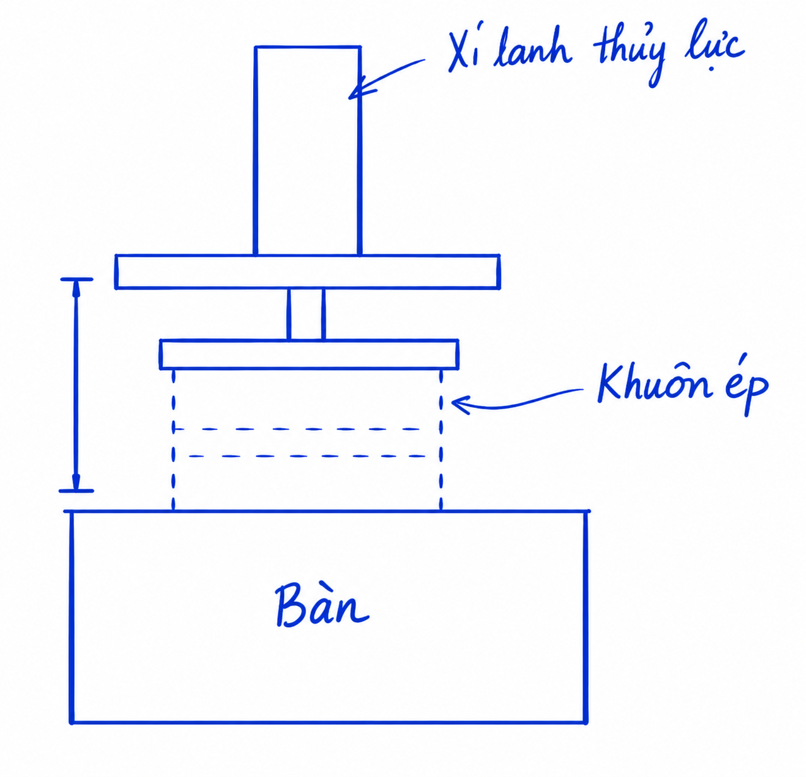
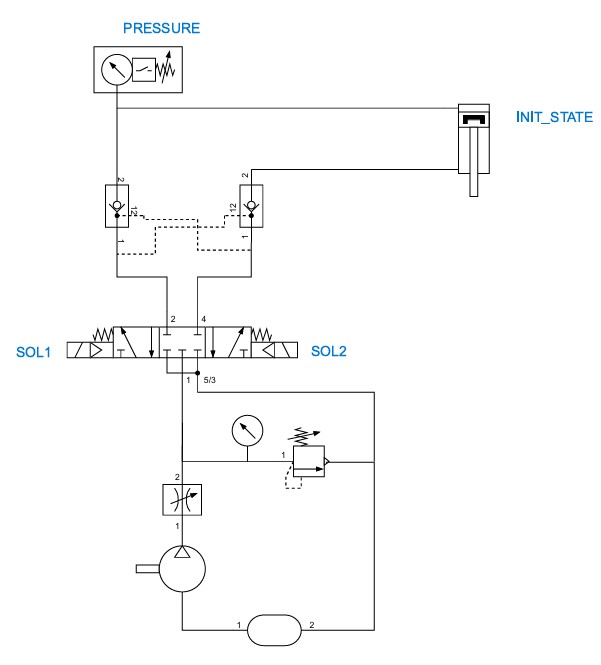
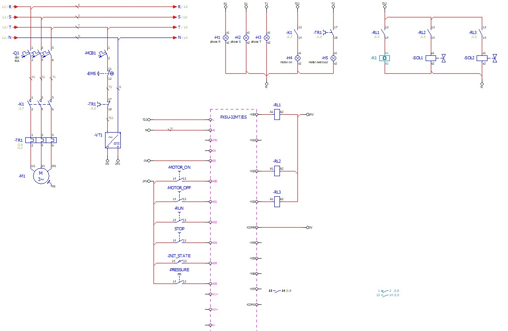
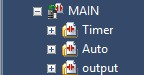
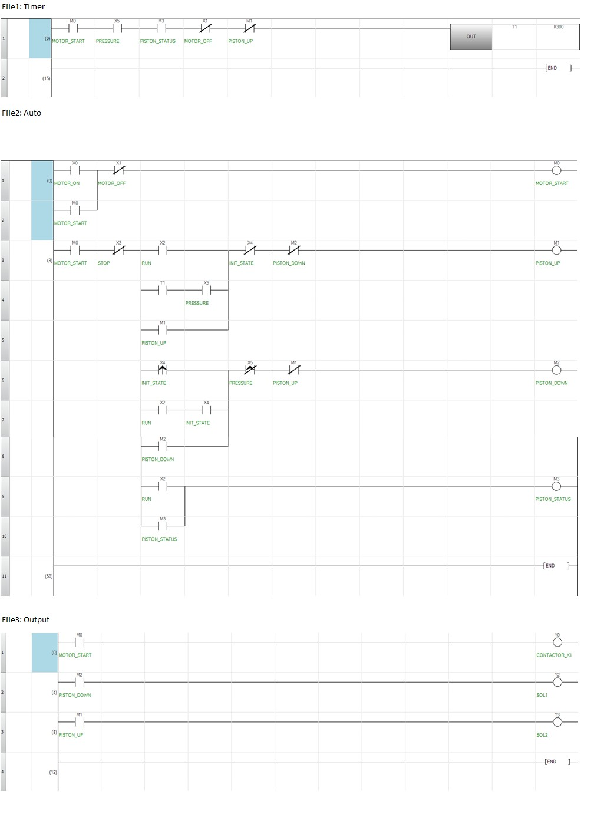
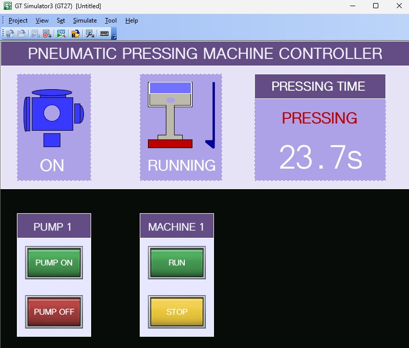

# Design a control system for Pressing Pneumatic system

This project is a PLC-based control system for a pneumatic valve mechanism using GxWork3 and GT designer 3

## 1. System objective

The system must perform the following sequence:

1. The pneumatic piston starts in the top position.
2. When the RUN signal is activated, the machine begins the automatic cycle.
3. The piston moves downward and applies pressure to the product.
4. The press cycle is maintained for 30 seconds while pressure is available.
5. After the timer expires, the piston moves back upward to the top position.

## 2. Pneumatic system

The pneumatic subsystem uses a double-solenoid valve 5/3 and a cylinder actuator to move the pistol up and down.

Description:

- INIT_STATE is limit switch at top position.
- PRESSURE is pressure switch confirms that sufficient compressed air is available before the press cycle continues.
- SOL1 is output signal that move the actuator downward for the pressing stroke.
- SOL2 is output signal that return the actuator upward to the top position.

## 3. Electric circuit

The electric circuit provides the control power and switching for the motor and the pneumatic solenoid valves.

Key electrical points:

- MOTOR_ON starts the motor drive.
- MOTOR_OFF stops the motor drive.
- RUN starts the automatic press cycle.
- STOP stop the pistol from moving.
- INIT_STATE confirms the piston is at the top position.
- PRESSURE confirm the sufficient compression.
- CONTACTOR_K1 start the motor.
- SOL1 drives the downward motion.
- SOL2 drives the upward motion.

## 4. PLC program

### PLC tag definition

| Name | Tag | Description |
| --- | --- | --- |
| X0 | MOTOR_ON | Starting motor button |
| X1 | MOTOR_OFF | Stopping motor button |
| X2 | RUN | Run button |
| X3 | STOP | Stop button |
| X4 | INIT_STATE | Limit switch sensor |
| X5 | PRESSURE | Level pressure sensor |
| Y0 | CONTACTOR_K1 | Contactor for starting motor |
| Y2 | SOL1 | Actuator moving down signal of pistol |
| Y3 | SOL2 | Actuator moving up signal of pistol |

### Structure program

The ladder logic in the project is organized into three main programs:

- Timer: creates the 30-second timing block.
- Auto: handles the automatic sequence and state transitions.
- Output: maps internal control bits to real PLC output solenoid outputs.

### Ladder program:

## 5. HMI design example:

 

Note: the button maybe both physical button and interative component hmi
